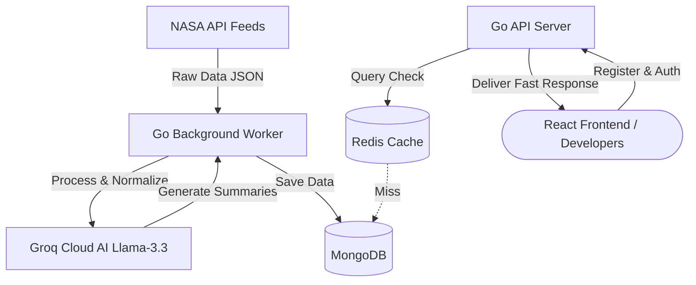
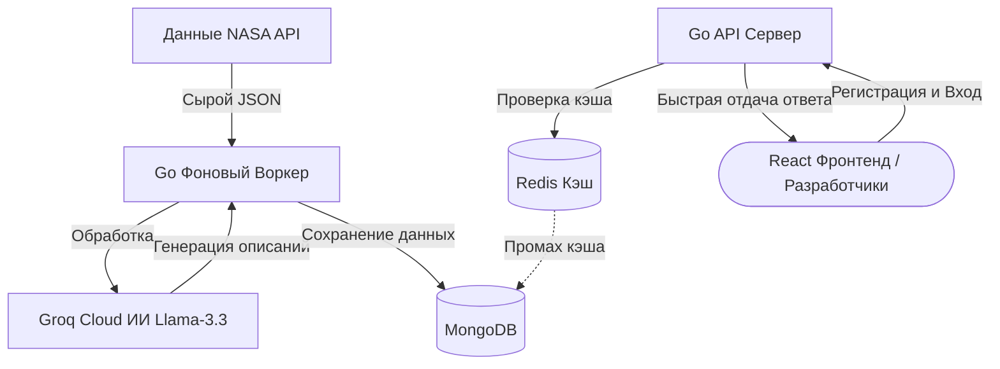

# SpaceFetch 🌌

[](https://golang.org)
[](https://react.dev)
[](https://threejs.org)
[](https://tailwindcss.com)
[](https://redis.io)
[](https://www.mongodb.com)
[](https://opensource.org/licenses/MIT)

---

### [English Version](#english) | [Русская Версия](#russian)

---

<a name="english"></a>
# English Version

**SpaceFetch** is a high-performance web service designed to scrape, clean, and normalize raw, complex feeds from NASA APIs (APOD, NeoWs, EPIC) and serve them through a unified, fast, and cached API endpoint, complete with AI-generated summaries powered by Groq (Llama 3.3). 

The project includes an interactive 3D WebGL landing page (built with Three.js/React Three Fiber) with glassmorphic widgets for instant API key registration.

## 🛠 Tech Stack

*   **Backend**: Go (Golang) 1.22+, net/http, MongoDB (Primary DB), Redis (Session & Data Caching).
*   **Frontend**: React 18, Vite, TypeScript, Three.js, `@react-three/fiber`, `@react-three/drei` (WebGL Scene), Framer Motion (Animations), Tailwind CSS.
*   **AI Integration**: Groq Cloud API (Llama 3.3 70B model) for automated space event summary generation.

## 📐 Architecture Flow



---

## ⚙️ Configuration & Environment

Create a `.env` file in the root directory. You can copy the template from `.env.example`:

```env
# NASA & AI credentials
NASA_API_KEY=YOUR_NASA_API_KEY
GROQ_API_KEY=YOUR_GROQ_API_KEY

# Database connections
MONGO_URI=mongodb://localhost:27017
MONGO_DB=spacefetch
REDIS_ADDR=localhost:6379
REDIS_PASSWORD=

# Service configuration
API_PORT=8080
WORKER_INTERVAL=6h
CACHE_TTL=3600
```

---

## 🚀 Quick Start

### Mode A: Docker Compose (Recommended)
Launch the entire infrastructure (Go API, background worker, React frontend, MongoDB, and Redis cache) with a single command:
```bash
./run.sh docker
```
*The script automatically handles missing permissions using `sudo` if necessary.*

### Mode B: Local Development
Ensure you have local instances of MongoDB (port `27017`) and Redis (port `6379`) running, then execute:
```bash
./run.sh local
```
*This starts the Go API server, background worker, and React frontend dev server concurrently. Pressing `Ctrl+C` will gracefully shut down all background processes.*

---

## 📡 API Specification

All authenticated requests require the `X-API-Key` header or `?api_key=` query parameter.

### 1. Register User (Public)
*   **Endpoint**: `POST /v1/users`
*   **Payload**:
    ```json
    {
      "email": "developer@spacefetch.dev"
    }
    ```
*   **Response (201 Created)**:
    ```json
    {
      "status": "success",
      "email": "developer@spacefetch.dev",
      "api_key": "sf_live_a1b2c3d4...",
      "tier": "free"
    }
    ```

### 2. Today's Asteroids (Protected)
*   **Endpoint**: `GET /v1/asteroids/today`
*   **Response (200 OK)**:
    ```json
    {
      "status": "success",
      "meta": {
        "cached": true,
        "response_time_ms": 3,
        "total_objects": 1
      },
      "data": [
        {
          "id": "3724056",
          "name": "(2015 NG13)",
          "is_hazardous": false,
          "metrics": {
            "diameter_meters": 45.0,
            "velocity_km_h": 64186.3,
            "miss_distance_km": 63745553.1
          },
          "mining_economy": {
            "estimated_value_usd": 4566651,
            "primary_materials": ["nickel", "iron"],
            "mining_difficulty": "low"
          },
          "ai_summary": {
            "en": "Asteroid (2015 NG13) is a 45-meter space rock worth $4.5M in raw nickel/iron.",
            "ru": "Астероид (2015 NG13) — 45-метровый камень оценочной стоимостью $4.5 млн."
          }
        }
      ]
    }
    ```

---

<a name="russian"></a>
# Русская Версия

**SpaceFetch** — это высокопроизводительный веб-сервис для сбора, очистки и нормализации данных из сложных фидов NASA API (APOD, NeoWs, EPIC) с предоставлением доступа через единый быстрый API-эндпоинт с AI-описаниями от Groq (Llama 3.3).

Проект оснащен интерактивным 3D WebGL лендингом (Three.js/React Three Fiber) со стекломорфными виджетами для моментального получения API-ключей разработчиками.

## 🛠 Стек технологий

*   **Бэкенд**: Go (Golang) 1.22+, net/http, MongoDB (основная БД), Redis (кэширование сессий и данных).
*   **Фронтенд**: React 18, Vite, TypeScript, Three.js, `@react-three/fiber`, `@react-three/drei` (3D сцена Земли), Framer Motion (анимации), Tailwind CSS.
*   **Интеграция ИИ**: Groq Cloud API (модель Llama 3.3 70B) для автоматической генерации описаний космических объектов.

## 📐 Схема Архитектуры



---

## ⚙️ Настройка окружения

Создайте файл `.env` в корневой директории проекта. Скопируйте шаблон из `.env.example`:

```env
# NASA & AI ключи
NASA_API_KEY=YOUR_NASA_API_KEY
GROQ_API_KEY=YOUR_GROQ_API_KEY

# Подключения баз данных
MONGO_URI=mongodb://localhost:27017
MONGO_DB=spacefetch
REDIS_ADDR=localhost:6379
REDIS_PASSWORD=

# Настройки сервиса
API_PORT=8080
WORKER_INTERVAL=6h
CACHE_TTL=3600
```

---

## 🚀 Быстрый старт

### Вариант А: Запуск в Docker Compose (Рекомендуемый)
Запустите всю инфраструктуру (Go API, фоновый воркер, React фронтенд, MongoDB и Redis кэш) одной командой:
```bash
./run.sh docker
```
*Скрипт автоматически использует `sudo`, если у пользователя недостаточно прав.*

### Вариант Б: Локальный запуск
Убедитесь, что у вас локально запущены MongoDB (порт `27017`) и Redis (порт `6379`), затем выполните:
```bash
./run.sh local
```
*Скрипт параллельно соберет и запустит Go API, фоновый воркер и dev-сервер React. Нажатие `Ctrl+C` корректно завершит работу всех процессов без утечек.*

---

## 📡 Спецификация API

Все защищенные запросы требуют передачи заголовка `X-API-Key` или GET-параметра `?api_key=`.

### 1. Регистрация пользователя (Публичный)
*   **Эндпоинт**: `POST /v1/users`
*   **Тело запроса**:
    ```json
    {
      "email": "developer@spacefetch.dev"
    }
    ```
*   **Ответ (201 Created)**:
    ```json
    {
      "status": "success",
      "email": "developer@spacefetch.dev",
      "api_key": "sf_live_a1b2c3d4...",
      "tier": "free"
    }
    ```

### 2. Сегодняшние астероиды (Защищенный)
*   **Эндпоинт**: `GET /v1/asteroids/today`
*   **Ответ (200 OK)**:
    ```json
    {
      "status": "success",
      "meta": {
        "cached": true,
        "response_time_ms": 3,
        "total_objects": 1
      },
      "data": [
        {
          "id": "3724056",
          "name": "(2015 NG13)",
          "is_hazardous": false,
          "metrics": {
            "diameter_meters": 45.0,
            "velocity_km_h": 64186.3,
            "miss_distance_km": 63745553.1
          },
          "mining_economy": {
            "estimated_value_usd": 4566651,
            "primary_materials": ["nickel", "iron"],
            "mining_difficulty": "low"
          },
          "ai_summary": {
            "en": "Asteroid (2015 NG13) is a 45-meter space rock worth $4.5M in raw nickel/iron.",
            "ru": "Астероид (2015 NG13) — 45-метровый камень оценочной стоимостью $4.5 млн."
          }
        }
      ]
    }
    ```