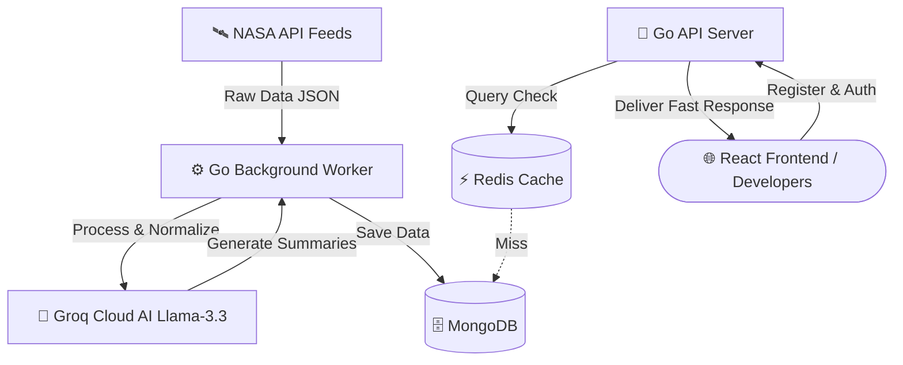

<div align="center">

# 🌌 SpaceFetch

### _The Universe at Your Fingertips_

<br/>

[](https://golang.org)
[](https://react.dev)
[](https://threejs.org)
[](https://typescriptlang.org)
[](https://redis.io)
[](https://www.mongodb.com)
[](https://opensource.org/licenses/MIT)

<br/>

> **SpaceFetch** is a high-performance web service that scrapes, cleans, and normalizes raw feeds from NASA APIs _(APOD, NeoWs, EPIC)_ — serving them through a unified, blazing-fast, cached API endpoint with AI-generated summaries powered by **Groq (Llama 3.3 70B)**.

<br/>

[🚀 Quick Start](#-quick-start-1) · [📡 API Docs](#-api-specification) · [🌍 Languages](#-supported-languages) · [📐 Architecture](#-architecture-flow)

---

</div>

<br/>

## 🌍 Supported Languages

<div align="center">

SpaceFetch speaks your language. The entire interface is fully localized in **9 languages** with automatic browser detection and instant switching.

<br/>

<table>
  <tr>
    <td align="center" width="200">
      
      <br/>
      <strong>🇺🇸 English</strong>
      <br/>
      <code>en</code>
    </td>
    <td align="center" width="200">
      
      <br/>
      <strong>🇷🇺 Русский</strong>
      <br/>
      <code>ru</code>
    </td>
    <td align="center" width="200">
      
      <br/>
      <strong>🇵🇱 Polski</strong>
      <br/>
      <code>pl</code>
    </td>
  </tr>
  <tr>
    <td align="center" width="200">
      
      <br/>
      <strong>🇺🇦 Українська</strong>
      <br/>
      <code>uk</code>
    </td>
    <td align="center" width="200">
      
      <br/>
      <strong>🇦🇲 Հայերեն</strong>
      <br/>
      <code>hy</code>
    </td>
    <td align="center" width="200">
      
      <br/>
      <strong>🇬🇪 ქართული</strong>
      <br/>
      <code>ka</code>
    </td>
  </tr>
  <tr>
    <td align="center" width="200">
      
      <br/>
      <strong>🇩🇪 Deutsch</strong>
      <br/>
      <code>de</code>
    </td>
    <td align="center" width="200">
      
      <br/>
      <strong>🇪🇸 Español</strong>
      <br/>
      <code>es</code>
    </td>
    <td align="center" width="200">
      
      <br/>
      <strong>🇫🇷 Français</strong>
      <br/>
      <code>fr</code>
    </td>
  </tr>
</table>

<br/>

> 💡 **Auto-detection** — SpaceFetch automatically detects your browser language and switches to it.  
> Your preference is saved in `localStorage` for instant recall on every visit.

</div>

<br/>

---

<br/>

## ✨ Key Features

<table>
  <tr>
    <td>🔭</td>
    <td><strong>NASA Data Pipeline</strong></td>
    <td>Real-time ingestion from APOD, NeoWs, and EPIC APIs with automated background workers</td>
  </tr>
  <tr>
    <td>🤖</td>
    <td><strong>AI Summaries</strong></td>
    <td>Groq-powered Llama 3.3 70B generates intelligent summaries for every space object</td>
  </tr>
  <tr>
    <td>⚡</td>
    <td><strong>Redis Caching</strong></td>
    <td>Sub-millisecond response times with intelligent cache invalidation</td>
  </tr>
  <tr>
    <td>🌐</td>
    <td><strong>3D WebGL Landing</strong></td>
    <td>Interactive Earth scene with Three.js, React Three Fiber, and glassmorphic widgets</td>
  </tr>
  <tr>
    <td>🔑</td>
    <td><strong>Instant API Keys</strong></td>
    <td>One-click registration with email — start querying space data in seconds</td>
  </tr>
  <tr>
    <td>🌍</td>
    <td><strong>9 Languages</strong></td>
    <td>Full i18n with auto-detection and persistent language preferences</td>
  </tr>
  <tr>
    <td>💎</td>
    <td><strong>Mining Economics</strong></td>
    <td>Asteroid valuation with material composition and mining difficulty analysis</td>
  </tr>
  <tr>
    <td>📊</td>
    <td><strong>Developer Console</strong></td>
    <td>Live API testing with real-time response visualization and terminal aesthetics</td>
  </tr>
</table>

<br/>

---

<br/>

## 🛠 Tech Stack

<div align="center">

| Layer | Technologies |
|:---:|:---|
| **Backend** | Go 1.22+ · net/http · MongoDB · Redis |
| **Frontend** | React 18 · Vite · TypeScript · Framer Motion |
| **3D Engine** | Three.js · @react-three/fiber · @react-three/drei |
| **AI** | Groq Cloud API · Llama 3.3 70B |
| **Infra** | Docker Compose · Nginx · GitHub Actions |
| **i18n** | Custom React Context + localStorage |

</div>

<br/>

---

<br/>

## 📐 Architecture Flow



<br/>

---

<br/>

## ⚙️ Configuration & Environment

Create a `.env` file in the root directory. You can copy the template from `.env.example`:

```env
# ═══════════════════════════════════════════
#  🔑 NASA & AI Credentials
# ═══════════════════════════════════════════
NASA_API_KEY=YOUR_NASA_API_KEY
GROQ_API_KEY=YOUR_GROQ_API_KEY

# ═══════════════════════════════════════════
#  🗄️ Database Connections
# ═══════════════════════════════════════════
MONGO_URI=mongodb://localhost:27017
MONGO_DB=spacefetch
REDIS_ADDR=localhost:6379
REDIS_PASSWORD=

# ═══════════════════════════════════════════
#  ⚙️ Service Configuration
# ═══════════════════════════════════════════
API_PORT=8080
WORKER_INTERVAL=6h
CACHE_TTL=3600
```

<br/>

---

<br/>

## 🚀 Quick Start

### 🐳 Mode A: Docker Compose _(Recommended)_

Launch the entire infrastructure — Go API, background worker, React frontend, MongoDB, and Redis — with a single command:

```bash
./run.sh docker
```

> The script automatically handles missing permissions using `sudo` if necessary.

### 💻 Mode B: Local Development

Ensure you have local instances of MongoDB (port `27017`) and Redis (port `6379`) running, then:

```bash
./run.sh local
```

> Starts the Go API server, background worker, and React frontend dev server concurrently.  
> Pressing `Ctrl+C` will gracefully shut down all processes.

<br/>

---

<br/>

## 📡 API Specification

All authenticated requests require the `X-API-Key` header or `?api_key=` query parameter.

<br/>

### 1️⃣ Register User _(Public)_

```
POST /v1/users
```

**Request Body:**
```json
{
  "email": "developer@spacefetch.dev"
}
```

**Response** `201 Created`:
```json
{
  "status": "success",
  "email": "developer@spacefetch.dev",
  "api_key": "sf_live_a1b2c3d4...",
  "tier": "free"
}
```

<br/>

### 2️⃣ Today's Asteroids _(Protected)_

```
GET /v1/asteroids/today
```

**Response** `200 OK`:
```json
{
  "status": "success",
  "meta": {
    "cached": true,
    "response_time_ms": 3,
    "total_objects": 1
  },
  "data": [
    {
      "id": "3724056",
      "name": "(2015 NG13)",
      "is_hazardous": false,
      "metrics": {
        "diameter_meters": 45.0,
        "velocity_km_h": 64186.3,
        "miss_distance_km": 63745553.1
      },
      "mining_economy": {
        "estimated_value_usd": 4566651,
        "primary_materials": ["nickel", "iron"],
        "mining_difficulty": "low"
      },
      "ai_summary": {
        "en": "Asteroid (2015 NG13) is a 45-meter space rock worth $4.5M in raw nickel/iron.",
        "ru": "Астероид (2015 NG13) — 45-метровый камень оценочной стоимостью $4.5 млн."
      }
    }
  ]
}
```

<br/>

### 3️⃣ Astronomy Picture of the Day _(Protected)_

```
GET /v1/apod
```

### 4️⃣ EPIC Earth Images _(Protected)_

```
GET /v1/epic/latest
```

<br/>

---

<br/>

<div align="center">

## 📊 API Response Flow

```
Client Request → Auth Check → Redis Cache
                                 ↓ HIT → Return Cached (< 1ms)
                                 ↓ MISS → MongoDB Query → Cache Result → Return (< 50ms)
```

</div>

<br/>

---

<br/>

<div align="center">

## 🔒 Rate Limits

| Tier | Requests | Window | Features |
|:---:|:---:|:---:|:---|
| 🆓 **Free** | 5 | per second | APOD, NeoWs, EPIC |
| ⭐ **Pro** | 50 | per second | + Priority Cache + Webhooks |
| 🏢 **Enterprise** | ∞ | unlimited | + Custom Endpoints + SLA |

</div>

<br/>

---

<br/>

<div align="center">

## 📁 Project Structure

</div>

```
SpaceFetch/
├── 🔧 cmd/
│   ├── api/            # API server entrypoint
│   └── worker/         # Background data worker
├── 📦 internal/
│   ├── handlers/       # HTTP route handlers
│   ├── middleware/      # Auth, rate limiting, CORS
│   ├── models/         # MongoDB document models
│   ├── services/       # Business logic layer
│   └── cache/          # Redis caching layer
├── 🌐 frontend/
│   ├── src/
│   │   ├── components/ # React UI components
│   │   ├── i18n/       # 🌍 Translations & language context
│   │   ├── pages/      # Route pages
│   │   └── three/      # WebGL 3D scene
│   └── public/         # Static assets
├── 🐳 docker-compose.yml
├── 📜 run.sh           # One-click launcher
└── 📄 .env.example     # Environment template
```

<br/>

---

<br/>

<div align="center">

## 🤝 Contributing

Contributions, issues, and feature requests are welcome!  
Feel free to check the [issues page](https://github.com/sargisis/SpaceFetch/issues).

<br/>

## 📄 License

This project is licensed under the **MIT License** — see the [LICENSE](LICENSE) file for details.

<br/>

---

<br/>

**Made with ❤️ and curiosity about the cosmos**

_If you found this project useful, please consider giving it a ⭐_

<br/>


</div>