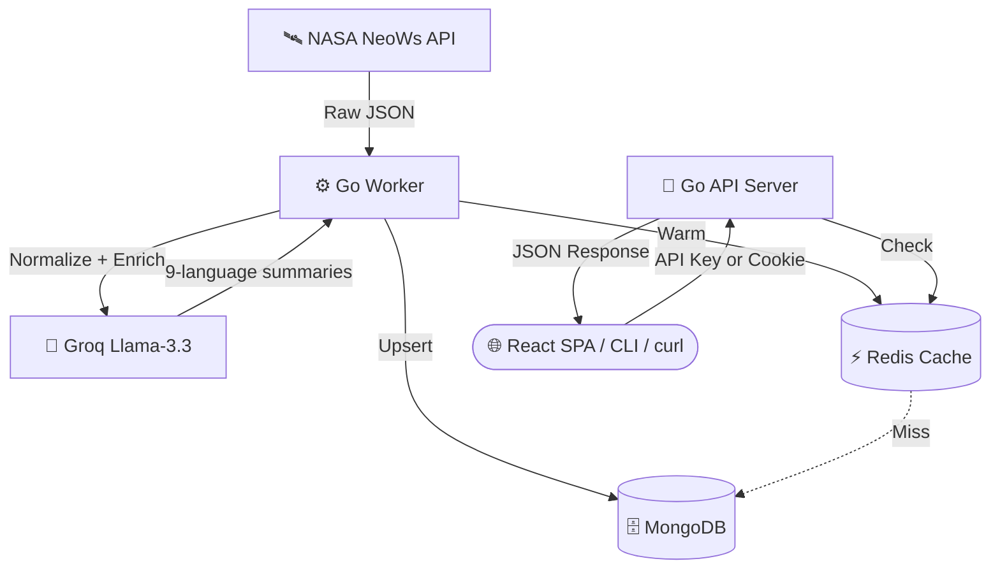

<div align="center">

# 🌌 SpaceFetch

### _The Universe at Your Fingertips_

<br/>

[](https://golang.org)
[](https://react.dev)
[](https://threejs.org)
[](https://typescriptlang.org)
[](https://redis.io)
[](https://www.mongodb.com)
[](https://opensource.org/licenses/MIT)

<br/>

> **SpaceFetch** — высокопроизводительный веб-сервис, который собирает, очищает и нормализует сырые данные NASA _(NeoWs, APOD, EPIC)_ и отдаёт их через единый кешируемый API с AI-сводками на **9 языках**, работающими на **Groq (Llama 3.3 70B)**.

<br/>

[🚀 Quick Start](#-quick-start) · [📡 API Docs](#-api-specification) · [🌍 Languages](#-supported-languages) · [📐 Architecture](#-architecture-flow)

---

</div>

<br/>

## 🌍 Supported Languages

<div align="center">

The entire interface and AI-generated asteroid summaries are fully localized in **9 languages** with automatic browser detection. Switch anytime via the dropdown in the header.

<br/>

<table>
  <tr>
    <td align="center" width="200"><strong>🇺🇸 English</strong><br/><code>en</code></td>
    <td align="center" width="200"><strong>🇷🇺 Русский</strong><br/><code>ru</code></td>
    <td align="center" width="200"><strong>🇵🇱 Polski</strong><br/><code>pl</code></td>
  </tr>
  <tr>
    <td align="center" width="200"><strong>🇺🇦 Українська</strong><br/><code>uk</code></td>
    <td align="center" width="200"><strong>🇦🇲 Հայերեն</strong><br/><code>hy</code></td>
    <td align="center" width="200"><strong>🇬🇪 ქართული</strong><br/><code>ka</code></td>
  </tr>
  <tr>
    <td align="center" width="200"><strong>🇩🇪 Deutsch</strong><br/><code>de</code></td>
    <td align="center" width="200"><strong>🇪🇸 Español</strong><br/><code>es</code></td>
    <td align="center" width="200"><strong>🇫🇷 Français</strong><br/><code>fr</code></td>
  </tr>
</table>

<br/>

> 💡 **Auto-detection** — язык определяется из `navigator.language`, сохраняется в `localStorage`. Переключение — в хедере справа, иконка 🌐.

</div>

<br/>

---

<br/>

## ✨ Key Features

<table>
  <tr>
    <td>🔭</td>
    <td><strong>NASA NeoWs Pipeline</strong></td>
    <td>Ежедневный сбор астероидов с NASA API, обогащение метриками и AI-сводками</td>
  </tr>
  <tr>
    <td>🤖</td>
    <td><strong>AI Summaries</strong></td>
    <td>Groq (Llama 3.3 70B) генерирует сводку для каждого астероида на всех 9 языках</td>
  </tr>
  <tr>
    <td>⚡</td>
    <td><strong>Redis Caching</strong></td>
    <td>Sub-millisecond response times — кеш греется автоматически после каждого воркера</td>
  </tr>
  <tr>
    <td>🌐</td>
    <td><strong>3D WebGL Earth</strong></td>
    <td>Интерактивная сцена с Three.js, React Three Fiber, астероидным поясом и bloom</td>
  </tr>
  <tr>
    <td>🔑</td>
    <td><strong>Dual Auth</strong></td>
    <td>API-ключи для внешних разработчиков + httpOnly cookie-сессии для веб-консоли</td>
  </tr>
  <tr>
    <td>🌍</td>
    <td><strong>9 Languages</strong></td>
    <td>Полная локализация интерфейса и AI-сводок с автоопределением языка</td>
  </tr>
  <tr>
    <td>💎</td>
    <td><strong>Mining Economics</strong></td>
    <td>Оценка стоимости астероидов по спектральному классу, составу и сложности добычи</td>
  </tr>
  <tr>
    <td>📊</td>
    <td><strong>Threat Dashboard</strong></td>
    <td>Дашборд угроз с композитным скорингом, сортировкой и AI-анализом</td>
  </tr>
</table>

<br/>

---

<br/>

## 🛠 Tech Stack

<div align="center">

| Layer | Technologies |
|:---:|:---|
| **Backend** | Go 1.22 · net/http (чистая stdlib) · MongoDB · Redis |
| **Frontend** | React 18 · Vite · TypeScript · Framer Motion · Tailwind CSS |
| **3D Engine** | Three.js · @react-three/fiber · @react-three/drei · postprocessing |
| **AI** | Groq Cloud API · Llama 3.3 70B (fallback: встроенный генератор) |
| **Infra** | Docker Compose · Multi-stage Dockerfile · Alpine |
| **i18n** | React Context + localStorage · inline translations |

</div>

<br/>

---

<br/>

## 📐 Architecture Flow


```mermaid
graph TD
    NASA[🛰️ NASA NeoWs API] -->|Raw JSON| Worker[⚙️ Go Worker]
    Worker -->|Normalize + Enrich| AI[🤖 Groq Llama-3.3]
    AI -->|9-language summaries| Worker
    Worker -->|Upsert| Mongo[(🗄️ MongoDB)]
    Worker -->|Warm| Redis[(⚡ Redis Cache)]
    API[🚀 Go API Server] -->|Check| Redis
    Redis -.->|Miss| Mongo
    API -->|JSON Response| Client([🌐 React SPA / CLI / curl])
    Client -->|API Key or Cookie| API
```

<br/>

---

<br/>

## ⚙️ Configuration

```env
NASA_API_KEY=DEMO_KEY            # https://api.nasa.gov (30 req/h)
GROQ_API_KEY=                    # https://console.groq.com (пусто = fallback)
MONGO_URI=mongodb://localhost:27017
MONGO_DB=spacefetch
REDIS_ADDR=localhost:6379
REDIS_PASSWORD=
API_PORT=8080
WORKER_INTERVAL=6h               # Интервал синка астероидов
CACHE_TTL=1h                     # TTL Redis-кеша
COOKIE_SECURE=false              # true в production (HTTPS)
FRONTEND_DIR=./frontend/dist     # Собранный фронтенд
ALLOWED_ORIGIN=                  # Доп. CORS-origins (через запятую)
```

<br/>

---

<br/>

## 🚀 Quick Start

### Docker (рекомендуется)

```bash
./run.sh docker
```

Поднимает MongoDB, Redis, API, Worker и фронтенд. Всё в одном compose.

### Local dev

```bash
./run.sh local
```

Требует локальных MongoDB (порт 27017) и Redis (порт 6379). Запускает API, Worker и Vite dev server.

<br/>

---

<br/>

## 📡 API Specification

Аутентификация: через заголовок `X-API-Key` (внешние клиенты) **или** httpOnly cookie `sf_session` (веб-консоль). API-ключи никогда не принимаются через query-параметры.

<br/>

### 1️⃣ Register Developer Key _(Public, IP-rate-limited)_

```
POST /v1/users
```

```json
{"email": "dev@example.com", "tier": "free"}
```

→ `201` + `{"api_key": "sf_live_..."}` (показывается **один раз**, хранится как SHA-256)

> `tier` опционален: `"free"` | `"premium"`. Rate limit: 5/min per IP.

<br/>

### 🔐 Console Auth (cookie sessions)

Сессии на Redis, httpOnly cookie `sf_session`, SameSite=Lax.

```
POST /v1/auth/register        {email, password, tier?}        → 201 + api_key + cookie
POST /v1/auth/login           {email, password}               → 200 + cookie
GET  /v1/auth/me                                               → 200 {email, tier}
POST /v1/auth/regenerate-key  (cookie required)                → 200 + новый api_key
POST /v1/auth/logout          (cookie required)                → 200, сессия удалена
```

- Пароль: 8–72 символа, bcrypt
- `/auth/register` и `/auth/login`: 10 запросов/min per IP

<br/>

### 2️⃣ Today's Asteroids _(Auth required)_

```
GET /v1/asteroids/today
```

**Response** `200 OK`:
```json
{
  "status": "success",
  "meta": {
    "cached": true,
    "response_time_ms": 3,
    "total_objects": 1
  },
  "data": [
    {
      "id": "3724056",
      "name": "(2015 NG13)",
      "is_hazardous": false,
      "metrics": {
        "diameter_meters": 45.0,
        "velocity_km_h": 64186.3,
        "miss_distance_km": 63745553.1
      },
      "mining_economy": {
        "estimated_value_usd": 4566651,
        "primary_materials": ["nickel", "iron"],
        "mining_difficulty": "low"
      },
      "ai_summary": {
        "en": "A 45-meter asteroid worth $4.5M in nickel/iron.",
        "ru": "45-метровый астероид стоимостью $4.5 млн.",
        "pl": "...",
        "uk": "...",
        "hy": "...",
        "ka": "...",
        "de": "...",
        "es": "...",
        "fr": "..."
      }
    }
  ]
}
```

<br/>

---

<br/>

## 🔒 Rate Limits

| Tier | Requests | Window | Endpoints |
|:---:|:---:|:---:|:---|
| 🆓 **Free** | 5 | per second | `/v1/asteroids/today` |
| ⭐ **Premium** | 50 | per second | `/v1/asteroids/today` + priority |

- IP limits на регистрацию: 5/min (`/v1/users`), 10/min (`/v1/auth/*`)

<br/>

---

<br/>

## 🔒 Security

- **Security Headers** — CSP, `X-Frame-Options: DENY`, `X-Content-Type-Options: nosniff`, `Referrer-Policy`, `Permissions-Policy`, HSTS (при HTTPS)
- **CSRF** — проверка Origin/Referer на всех POST-эндпоинтах аутентификации
- **Session Fixation** — регенерация session ID при каждом login/register
- **Body Limit** — `MaxBytesReader` (1 MB) на всех входящих запросах
- **httpOnly Cookies** — сессионная cookie недоступна из JavaScript
- **SHA-256 API Keys** — ключи хешируются при хранении, отдаются один раз
- **IP Rate Limiting** — троттлинг регистрации/логина по IP (atomic Lua в Redis)
- **Connection Reuse** — drain HTTP-ответов перед `Close()` для переиспользования соединений

<br/>

---

<br/>

## 🔧 CLI Client

В `cmd/spacefetch` — standalone CLI-клиент для работы с API из терминала:

```
spacefetch login          # Сохранить API-ключ
spacefetch today          # Астероиды сегодня
spacefetch apod           # APOD (резервировано)
spacefetch epic           # EPIC (резервировано)
```

Поддерживает `--json`, `--lang`, `--save`, `--api`, `NO_COLOR`.

<br/>

---

<br/>

<div align="center">

## 📁 Project Structure

```
SpaceFetch/
├── cmd/
│   ├── api/               # Точка входа API-сервера
│   ├── worker/            # Фоновый воркер (NASA → AI → MongoDB)
│   └── spacefetch/        # CLI-клиент
├── internal/
│   ├── api/               # HTTP-хендлеры, auth, middleware, router
│   ├── config/            # Централизованная конфигурация из env
│   ├── models/            # Go-модели данных
│   ├── database/          # MongoDB (CRUD, индексы, CleanupTest)
│   ├── cache/             # Redis (кеш, rate limiter, Lua-скрипты)
│   ├── nasa/              # HTTP-клиент NASA (NeoWs, APOD, EPIC)
│   └── worker/            # Оркестрация воркера (sync, enrichment)
├── frontend/
│   ├── src/
│   │   ├── components/    # 14 React-компонентов
│   │   ├── i18n/          # 9 языков: контекст + переводы
│   │   └── config.ts      # API endpoint resolver
│   └── dist/              # Сборка (сгенерировано)
├── docker-compose.yml
├── run.sh                 # Запуск одной командой
└── .env.example
```

</div>

<br/>

---

<br/>

## 📊 Response Flow

```
Client → Auth Check → Redis Cache → HIT → <1ms response
                                    → MISS → MongoDB → Cache → response
```

<br/>

---

<br/>

<div align="center">

## 🤝 Contributing

[Issues](https://github.com/sargisis/SpaceFetch/issues) и PR приветствуются.

<br/>

## 📄 License

MIT — see [LICENSE](LICENSE).

<br/>

---

<br/>

**Made with ❤️ and curiosity about the cosmos**

_If you found this project useful, please consider giving it a ⭐_

<br/>


</div>
